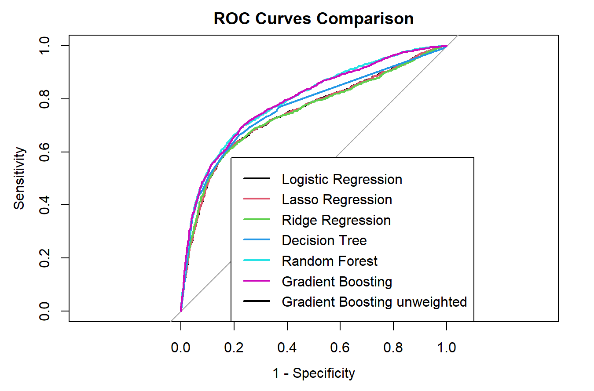
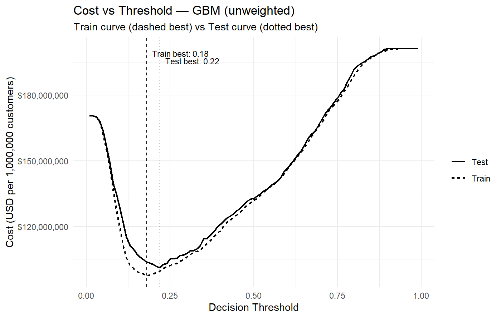
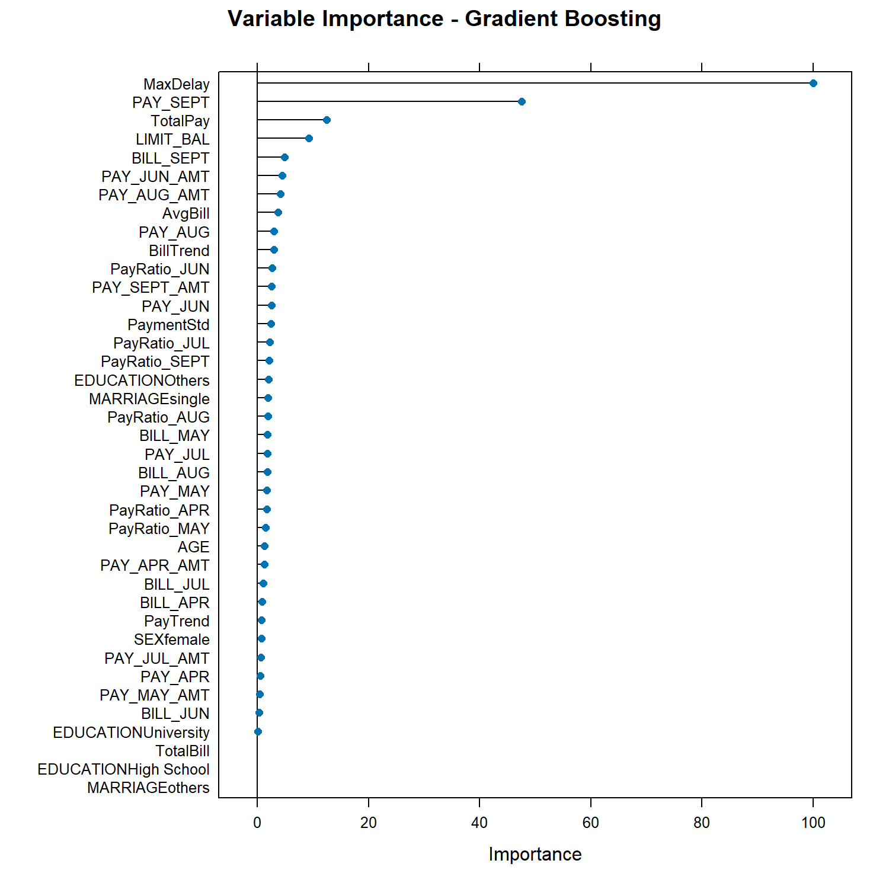

# Cost-Sensitive Credit Card Default Prediction

An end-to-end machine learning pipeline for predicting credit card default using six supervised learning algorithms. Instead of selecting models solely based on ROC-AUC, this project incorporates asymmetric business costs and cost-sensitive threshold optimization to better reflect real-world credit risk decisions.

---

## Project Overview

Credit card default prediction is a classic binary classification problem with highly asymmetric costs. Missing a future default can lead to substantial financial losses, whereas incorrectly rejecting a creditworthy customer mainly results in opportunity costs.

This project compares six machine learning models under both traditional classification metrics and a business-oriented cost framework. The objective is not simply to maximize predictive performance, but to minimize expected financial losses.

---

## Models

- Logistic Regression
- Lasso Regression
- Ridge Regression
- Decision Tree
- Random Forest
- Gradient Boosting

---

## Workflow

- Data cleaning and preprocessing
- Exploratory data analysis
- Feature engineering
- Stratified train / validation / holdout split
- Handling class imbalance through class weighting
- Hyperparameter tuning using cross-validation
- Model evaluation (ROC-AUC, Accuracy, Sensitivity, Specificity)
- Cost-sensitive threshold optimization
- Final evaluation on an unseen holdout dataset

---

## Feature Engineering

Several additional features were created to better capture repayment behaviour, including:

- Payment-to-bill ratios
- Total bill amount
- Total payment amount
- Maximum historical payment delay
- Bill trend over time
- Payment variability

---

## Key Findings

- Traditional ROC-AUC alone was not sufficient for selecting the economically best model.
- Gradient Boosting achieved the lowest expected business costs after threshold optimization.
- Threshold stability proved to be an important indicator of model generalization.
- Recent payment behaviour was substantially more informative than demographic variables.

---

## Results

### ROC Comparison



### Cost-Sensitive Threshold Optimization


### Cost-Sensitive Threshold Optimization - Unweighted Comparison



### Variable Importance




## Full Report

A detailed description of the methodology, experiments, results, and discussion is available in:

📄 **[credit-card-default-report.pdf](credit-card-default-report.pdf)**

---


## Repository Structure

```
.
├── main.R
├── credit_card_default_report.pdf
├── data/
│   └── data_creditcard.xlsx
└── README.md
```

---

## Dataset

The project uses the **Default of Credit Card Clients** dataset introduced by Yeh & Lien (2009), containing information on 30,000 Taiwanese credit card clients.

Reference:

> Yeh, I.-C., & Lien, C.-H. (2009). *The comparisons of data mining techniques for the predictive accuracy of probability of default of credit card clients*. Expert Systems with Applications.

---


## Technologies

- R
- caret
- glmnet
- ranger
- gbm
- ggplot2
- pROC
- tidyverseg
- readxl

## Lessons Learned

This project highlighted that optimizing purely for ROC-AUC does not necessarily lead to economically optimal decisions. Incorporating business costs into threshold selection can substantially improve real-world decision making despite similar predictive performance.

---

## Author

Robert Puselja